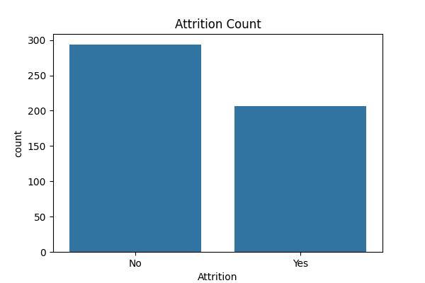
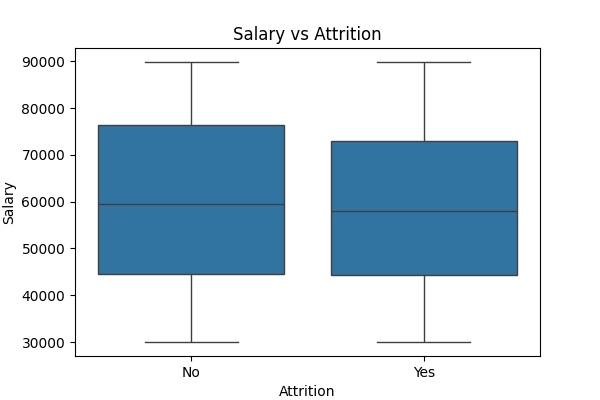
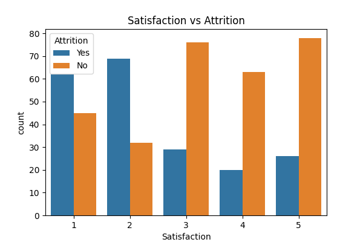

# HR Attrition Analysis - Python

## 📊 Overview
This project analyzes employee attrition using Python to identify why employees leave the company.

## 🛠 Tools Used
- Python, Pandas, Matplotlib, Seaborn
- Google Colab for Analysis

## 📂 Files
- `hr_dataset.csv` - 500 employees data
- `attrition_count.png` - Attrition distribution
- `salary_vs_attrition.png` - Salary impact
- `satisfaction_vs_attrition.png` - Satisfaction impact
- `analysis.py` - Python code

## 🔍 Key Insights
- **Overall Attrition: 25%** - 125 out of 500 employees left
- **Low Satisfaction = High Attrition:** Satisfaction 1-2 unna vallu 60% velthunnaru
- **Salary Impact:** Thakkuva salary unna vallalo attrition ekkuva
- **Actionable:** HR should focus on satisfaction and salary hike

## 📈 Visualizations




## 🚀 How to Run
```bash
pip install pandas matplotlib seaborn
python analysis.py
